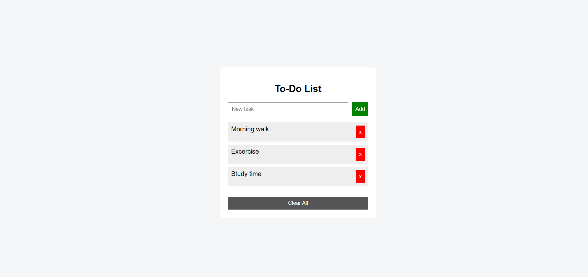

# JS-01 - To-Do List App

## Objective
Build a To-Do List app using JavaScript.

## What I Implemented
- Add tasks
- Delete tasks
- Clear all tasks
- Stored tasks using localStorage

## Key Learnings
- DOM manipulation using innerHTML
- Event handling using onclick
- Using arrays as state
- Persisting data using localStorage

## Output

### To-DO App
