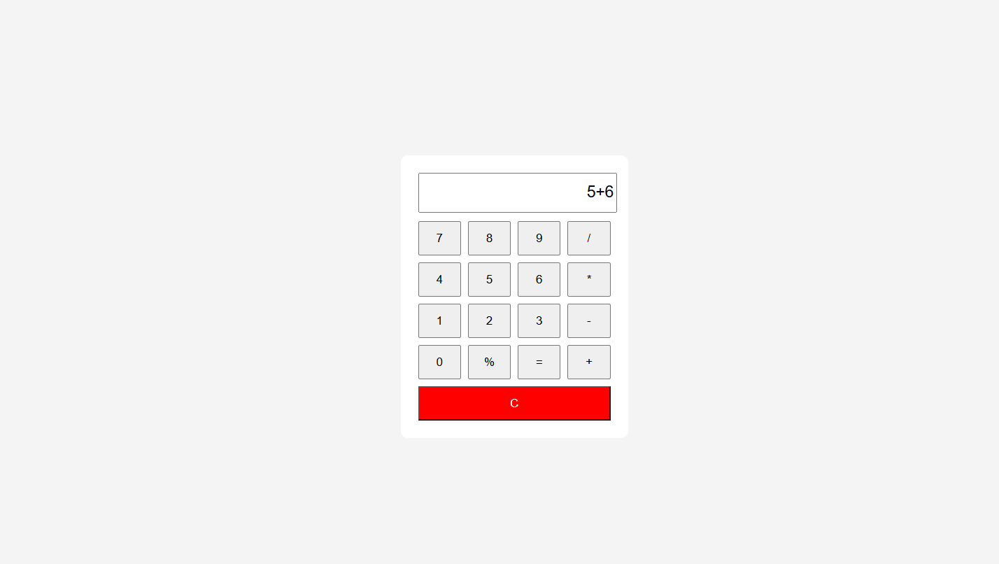

# JS-02 - Calculator App

## Objective
Build a basic calculator using JavaScript.

## What I Implemented
- Performed arithmetic operations (+, -, *, /)
- Added modulus (%) operation
- Clear display functionality
- Dynamic display updates using button clicks

## Key Learnings
- Captured user input through button events
- Evaluated expressions using JavaScript eval()
- Used CSS Grid for layout structure

## Output

### Calculator
