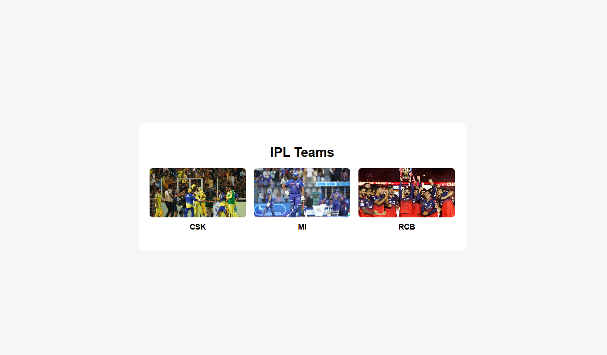
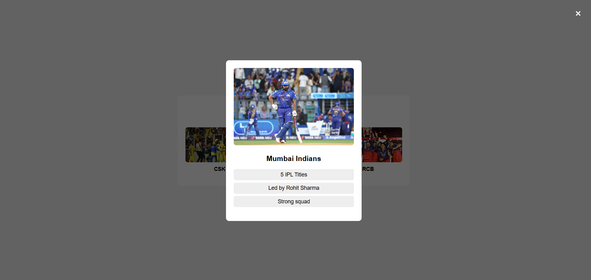

## 📌 Task-03 · Image Lightbox Modal

###  Objective
To implement a dynamic image lightbox modal using JavaScript, where clicking on a card displays detailed information in a popup.

---

###  What I Implemented
- Built a **horizontal image gallery** for IPL teams  
- Used **`data-*` attributes** to store team identifiers  
- Created a **dynamic modal popup** using JavaScript  
- Populated modal content (image, title, points) from a **central data object**  
- Implemented **multiple closing mechanisms**:
  - Close button  
  - Click outside modal  
- Added **smooth transition effects** using CSS (`opacity + visibility`)  

---

###  Output

#### 🔹 Modal Closed

#### 🔹 Modal Open

---

###  Key Learnings

- **Data-driven UI**  
  Used a centralized JavaScript object to dynamically render modal content.

- **`data-*` + `dataset` usage**  
  Passed identifiers from HTML to JavaScript cleanly without hardcoding logic.

- **State management using CSS + JS**  
  Controlled modal visibility using class toggling with smooth transitions.

---