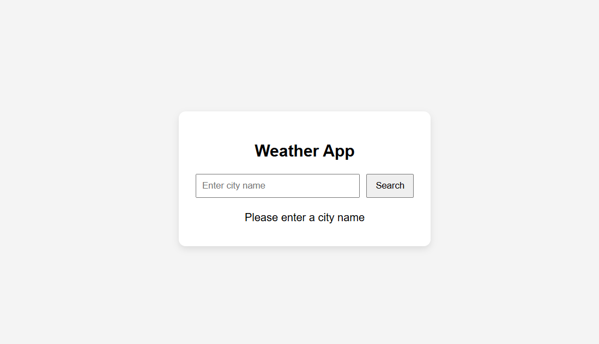
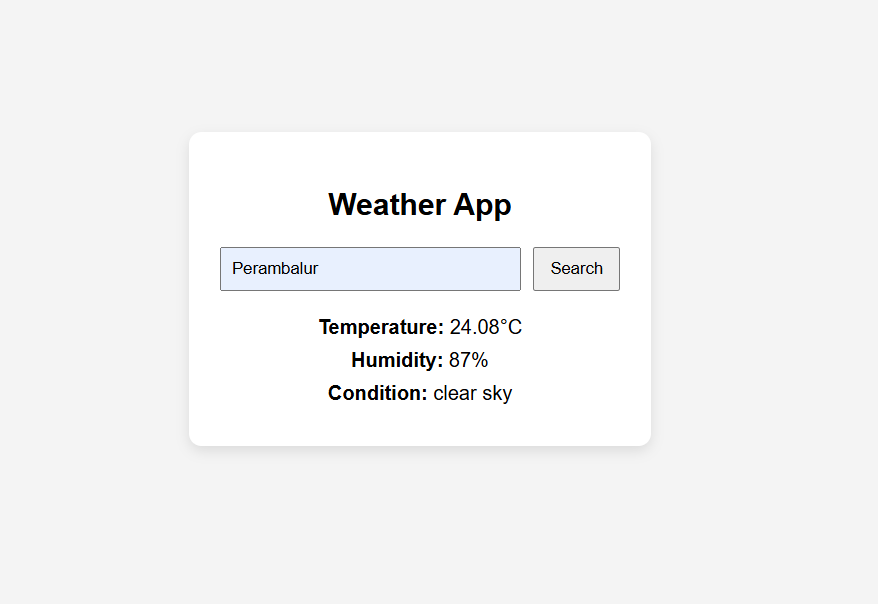

# JS-04 : Weather App

##  Objective
To build a simple weather application using JavaScript that fetches real-time weather data from an API and displays it dynamically based on user input.

---

##  What I Implemented

- Created a weather search interface where users can enter a city name
- Integrated a weather API to fetch real-time data
- Used `fetch()` for handling API requests
- Displayed key weather details:
  - Temperature
  - Weather condition (Cloudy, Sunny, Rainy, etc.)
  - City name
- Added dynamic UI updates based on API response
- Implemented basic error handling for:
  - Invalid city names
  - Empty input
- Styled the app with clean and minimal CSS for better UI

---

## Key Learnings

- Understanding how to work with APIs using `fetch()`
- Handling asynchronous JavaScript (Promises)
- Parsing JSON data and updating the DOM dynamically
- Managing user input and validation
- Structuring JS code for real-time applications

---

## 📸 Output

### 🔹 Initial State (Before Search)

---

### 🔹 After Search (Weather Display)

