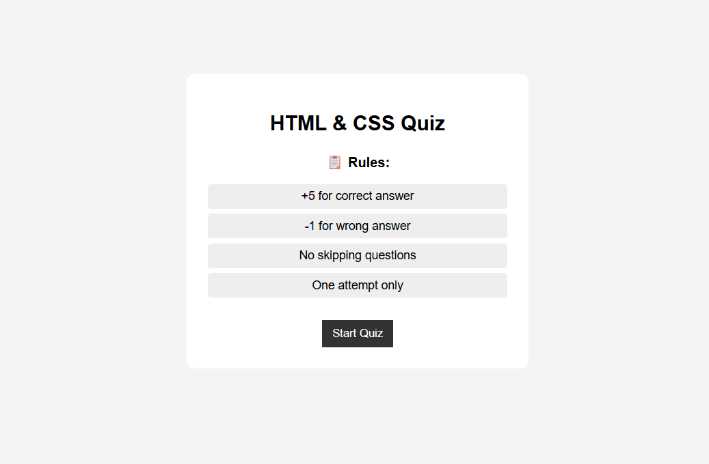
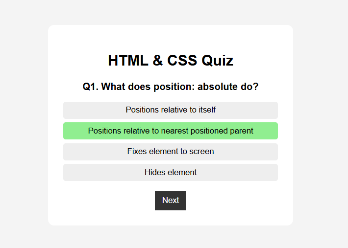
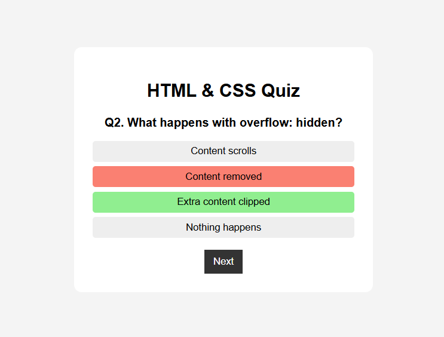
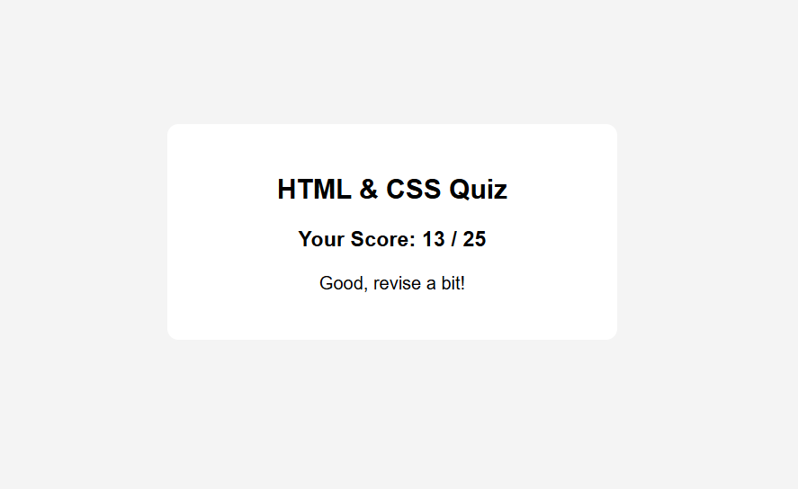

# JS-Quiz App (Task)

## Objective
Build a simple interactive quiz application using JavaScript with dynamic question rendering, answer validation, and score tracking.

## What I Implemented
- Start screen with rules section
- Dynamic question loading using JavaScript
- Option selection with visual feedback
- Answer validation (correct → green, wrong → red)
- Score calculation (+5 correct, -1 wrong)
- Next question navigation
- Final result screen with:
  - Score display (e.g., 19 / 25)
  - Performance message based on percentage
- Clean UI with minimal CSS styling
- State reset on refresh (default browser behavior)

## Output

### Rules Screen

---
### Question Screen

## Correct

## Wrong

---
### Result Screen

## Key Learnings
- DOM manipulation (createElement, innerText, event handling)
- Managing application state (currentQuestion, score)
- Dynamic UI updates without page reload
- Conditional rendering and user feedback
- Using percentage instead of hardcoded score logic
