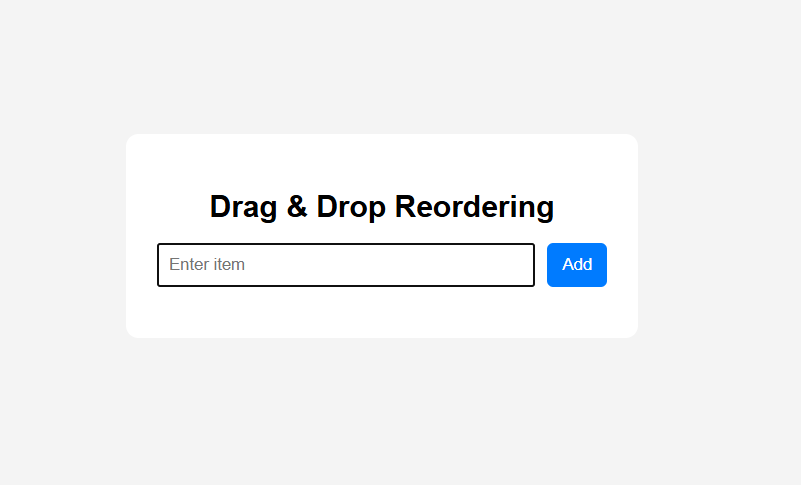
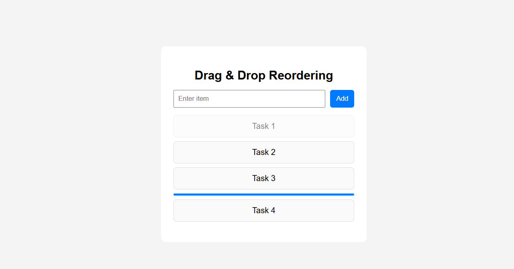
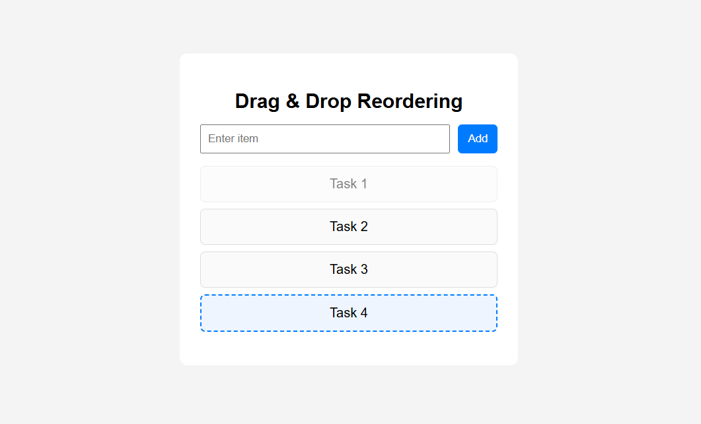

# JS-06: Drag and Drop Reordering

## Objective
To implement a dynamic list that supports drag-and-drop reordering with both insertion and swap behaviors.

## What I Implemented
- Built a draggable list using HTML5 Drag and Drop API
- Implemented hybrid logic:
  - Insert above and below based on cursor position
  - Swap items when hovered over the center
- Added visual indicators:
  - Line placeholder for insert positions
  - Dotted highlight for swap interaction
- Enabled dynamic addition of list items
- Managed DOM updates without page reload

## Output

- Initial UI  
  

- Insert Position (Line Indicator)  
  

- Swap Highlight  
  
