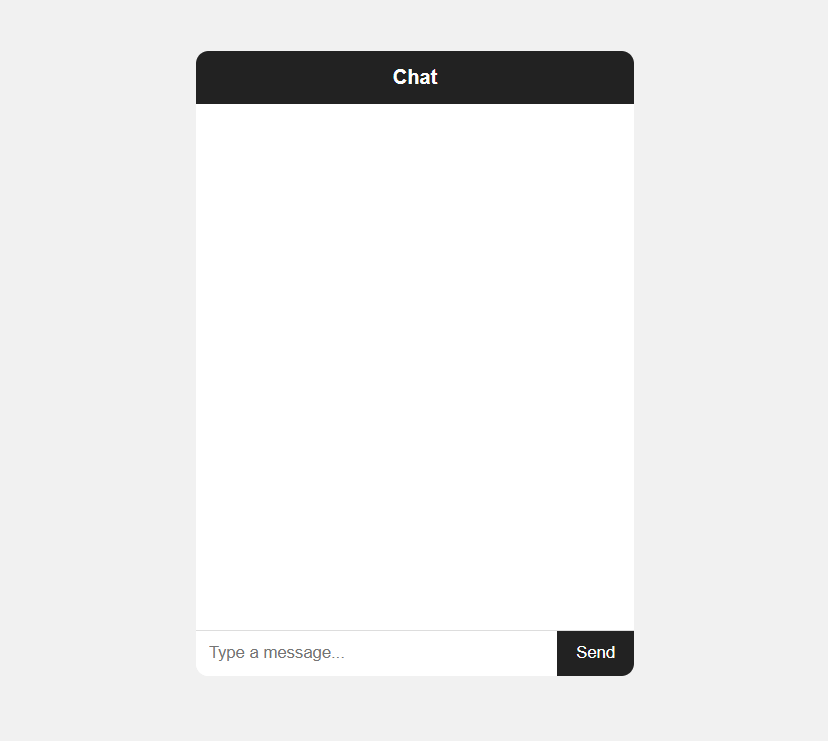
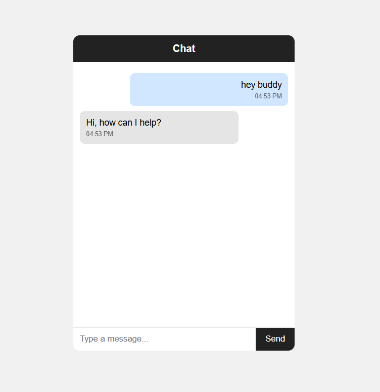
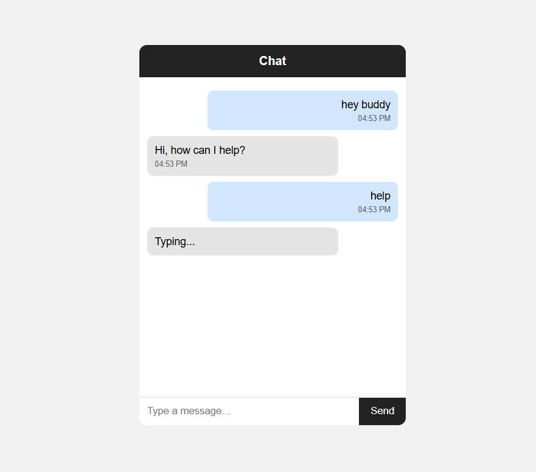

# JS-07 : Real-time Chat Simulation

## Objective
Build a chat interface that simulates real-time messaging without a backend.

## What I Implemented
- Created a chat UI with dynamic message rendering using DOM manipulation.
- Simulated real-time replies using setTimeout with a typing indicator.
- Implemented smart replies using keyword-based matching for better interaction.
- Added a fallback reply system with recent-message filtering to avoid repetition.
- Supported Enter key input along with button-based message sending.
- Displayed timestamps and enabled auto-scroll for better user experience.

---

## Output

