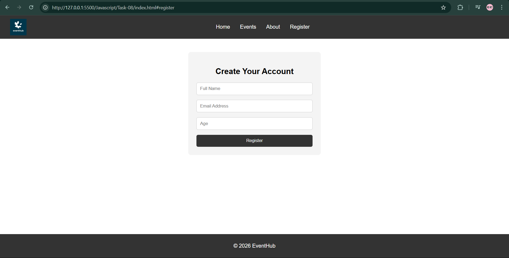

# JS-08 : Hash-Based SPA Routing

##  Objective
Implement a basic Single Page Application (SPA) using hash-based routing without reloading the page.

---

##  What I Implemented

- Built a SPA using **hash-based routing (`window.location.hash`)**
- Dynamically loaded pages using **Fetch API**
- Created reusable **Header and Footer components**
- Implemented routing logic in `app.js`
- Maintained a **single HTML shell (`index.html`)**
- Preserved internal navigation (scroll-based sections in home page)
- Enabled seamless navigation between **Home and Register pages without reload**

---

##  Folder Structure
Task-08/ 
│ 
├── index.html 
├── style.css 
├── app.js 
│ 
├── components/ 
│ ├── header.html 
│ └── footer.html 
│ 
├── pages/ 
│ ├── home.html 
│ └── register.html 
│
├── assets/
│ └── images/
|
└── screenshots/

---

##  Output

### Home Page

### Register Page

---

##  Learnings

- Implemented SPA behavior using JavaScript without frameworks.
- Understood how hash-based routing controls UI rendering.
- Learned dynamic DOM updates using Fetch API and `innerHTML`.
- Realized the importance of execution order in DOM rendering and scrolling.