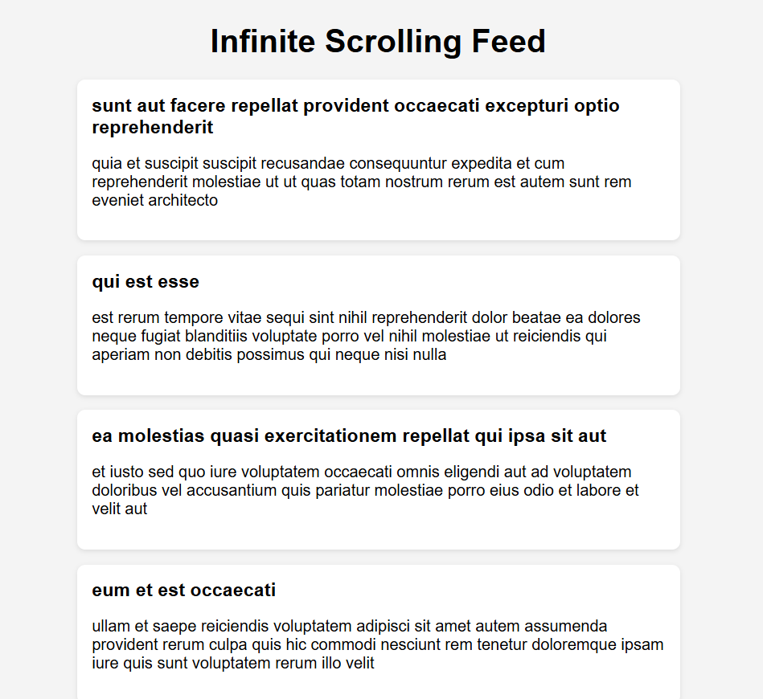
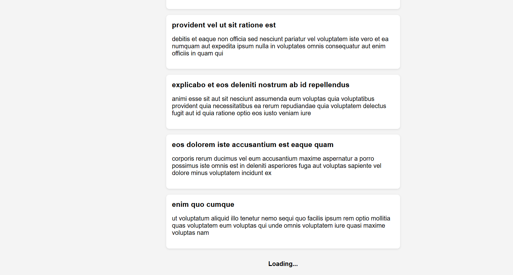
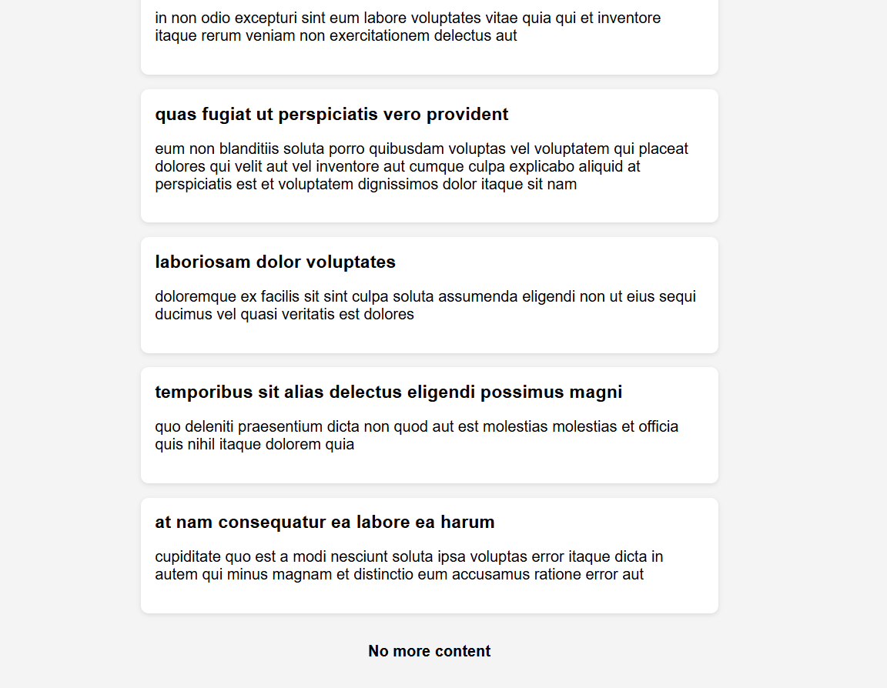

# JS-09 : Infinite Scrolling Content Loader

##  Objective
To implement an infinite scrolling mechanism that dynamically loads and appends content as the user scrolls near the bottom of the page.

---

##  What I Implemented

- Implemented scroll detection using the window scroll event to trigger data loading near the bottom of the page.
- Used Fetch API with pagination to load data in chunks instead of loading everything at once.
- Managed application state using `isLoading` to prevent multiple API calls and `hasMore` to stop requests when no data is left.
- Dynamically created and appended content to the DOM without page reload, ensuring smooth user experience.

---

##  Output

###  Initial State

###  Loading State
- Displays a loader while fetching new data.

---

###  No More Content
- Displays a message when all data has been loaded and stops further API calls.

---

