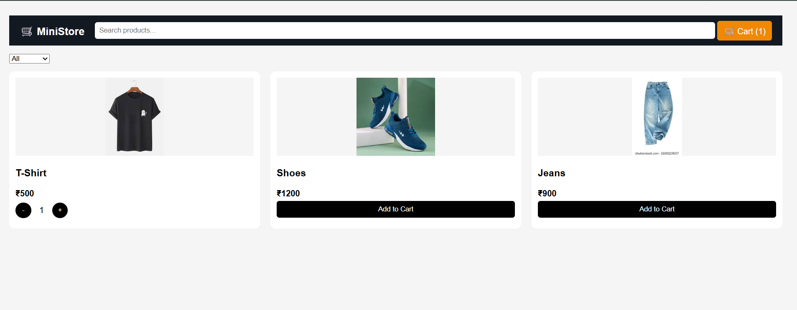
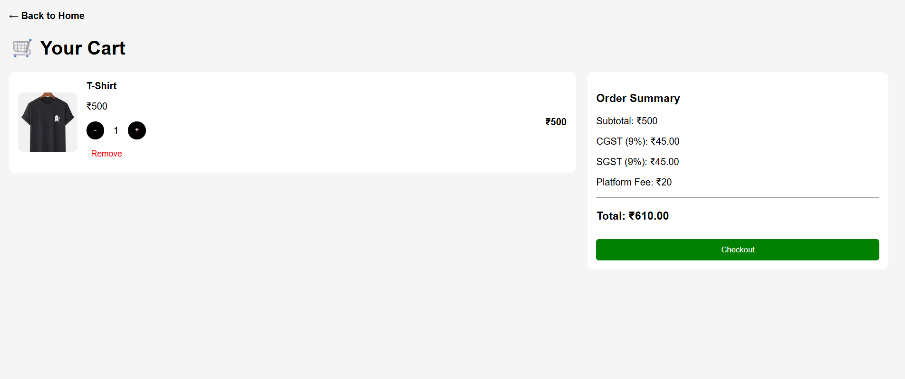

# 🛒 GIT-10 · Cart System with Dynamic Updates

## 🎯 Objective

Build a dynamic cart system that allows users to add products, update quantities, and view real-time price calculations including taxes and total cost.

---

## 🛠️ What I Implemented

* **Product Listing Page**

  * Displayed products using dynamic rendering (`map + join`)
  * Implemented search and category filtering
  * Added "Add to Cart" and quantity controls

* **Cart Management System**

  * Centralized cart logic in `cart.js` (reusable module)
  * Used `localStorage` to persist cart data across pages
  * Implemented functions:

    * `addToCart()`
    * `updateQty()`
    * `getCart()`

* **Cart Page**

  * Displayed cart items dynamically
  * Implemented quantity update (+ / -) and remove functionality
  * Handled empty cart state

* **Dynamic Price Calculation**

  * Subtotal calculated using `reduce`
  * CGST (9%) and SGST (9%) computed dynamically
  * Platform fee added
  * Total updated on every cart change

* **State Management**

  * Cart stored in `localStorage` (single source of truth)
  * UI re-renders based on latest state
  * Ensures consistency across navigation

---

## 📸 Output

### 🏠 Product Page

* Displays products with add/update cart options

### 🛒 Cart Page

* Shows selected items
* Displays subtotal, taxes, and final total
* Supports quantity updates and removal

---

## 🚀 Conclusion

This task demonstrates a modular and scalable approach to building a cart system using vanilla JavaScript, with dynamic rendering, state persistence, and real-time UI updates.
